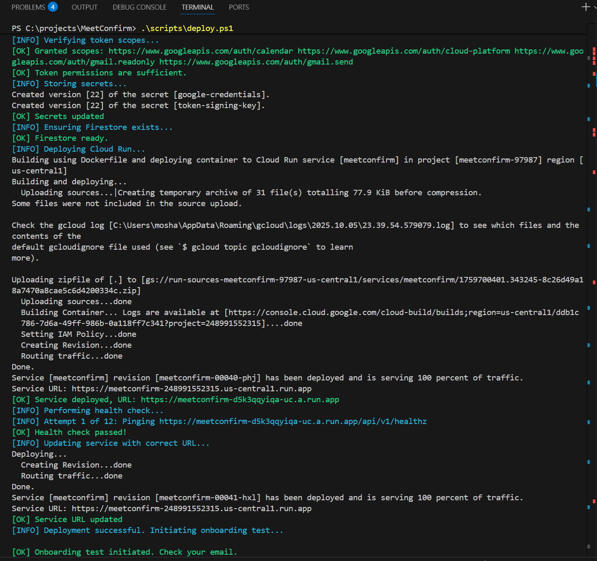

# Deploy MeetConfirm in 15 Minutes

This guide provides a step-by-step walkthrough for deploying the MeetConfirm service to your Google Cloud Platform project. The process is almost fully automated and should take about 15 minutes.

## Why This Matters

In a world of complex cloud deployments, MeetConfirm demonstrates a different approach. This project is a showcase of how modern AI-assisted tools and a tightly integrated cloud ecosystem can make sophisticated, event-driven applications accessible to everyone.

The deployment script, co-developed with **Gemini 2.5 Pro and Cline**, automates nearly every step, from API enablement to container deployment. It's a practical example of how AI can serve as a "DevOps engineer in a box," allowing founders and developers to focus on building products, not just managing infrastructure.

## Prerequisites

Before you begin, ensure you have the following installed and configured:

*   **Google Cloud SDK:** [Install gcloud](https://cloud.google.com/sdk/docs/install).
*   **Active gcloud Authentication:** Before running any scripts, you **must** authenticate the gcloud CLI by running the following command in your terminal and following the browser-based login process:
    ```bash
    gcloud auth login
    ```
*   **A GCP Project:** The deployment script can create a new GCP project for you. If you prefer to use an existing project, please have the Project ID ready.
*   **A GCP Billing Account:** The script can link your project to an existing billing account. If you do not have one, you will be guided to create one in the Google Cloud Console.
*   **PowerShell** (for Windows) or **Bash** (for Linux/macOS).
*   **curl** and **jq** (for Linux/macOS).

## Automatic Deployment

The deployment process is handled by a single script that automates resource creation and configuration. Simply run the script, and it will guide you through the process.

### Running the Script

**On Windows (PowerShell):**

```powershell
.\scripts\deploy.ps1
```

**On Linux/macOS (Bash):**

```bash
chmod +x scripts/deploy.sh
./scripts/deploy.sh
```

### The Process

1.  **Project Configuration:** The script will first ask for your GCP Project ID and desired region.
2.  **Credential Creation (Manual Step):** The script will check for a `client_secret.json` file. If it's not found, it will pause and provide you with a URL and clear, step-by-step instructions to create and download the file.
3.  **Browser Authentication (Manual Step):** The script will then generate another URL. Open this in your browser to grant the application permission to access your Google Calendar and Gmail. Paste the final redirect URL back into the terminal when prompted.
4.  **Automated Setup:** The script will then take over and automatically:
    *   Enable all necessary Google Cloud APIs.
    *   Create a Firestore database and a Cloud Tasks queue.
    *   Securely store your credentials in Secret Manager.
    *   Build and deploy the application to Cloud Run.
    *   Perform a health check to ensure the service is live.
    *   Configure the Google Calendar webhook.

### Expected Output

A successful deployment will look like this:



```
✓ Token refresh successful!
✓ Calendar API works!
✓ Service deployed: https://meetconfirm-xxxxxx.run.app
✓ Calendar watch configured!
```

## Verification

After deployment, you can verify that the service is running correctly:

1.  **Health Check:**
    ```bash
    curl https://<your-service-url>/api/v1/healthz
    ```
    This should return `{"status":"ok"}`.

2.  **Trigger Onboarding Test:**
    The deployment script does this automatically, but you can trigger it manually:
    ```bash
    curl -X POST -H "Authorization: Bearer $(gcloud auth print-identity-token)" https://<your-service-url>/api/v1/onboarding/run-test
    ```
    This will send a welcome email and create a test event in your calendar, which will trigger the confirmation flow.

---

For a high-level overview of the project, see [README.md](README.md).  
For a detailed look at the internal logic, see [ARCHITECTURE.md](ARCHITECTURE.md).
