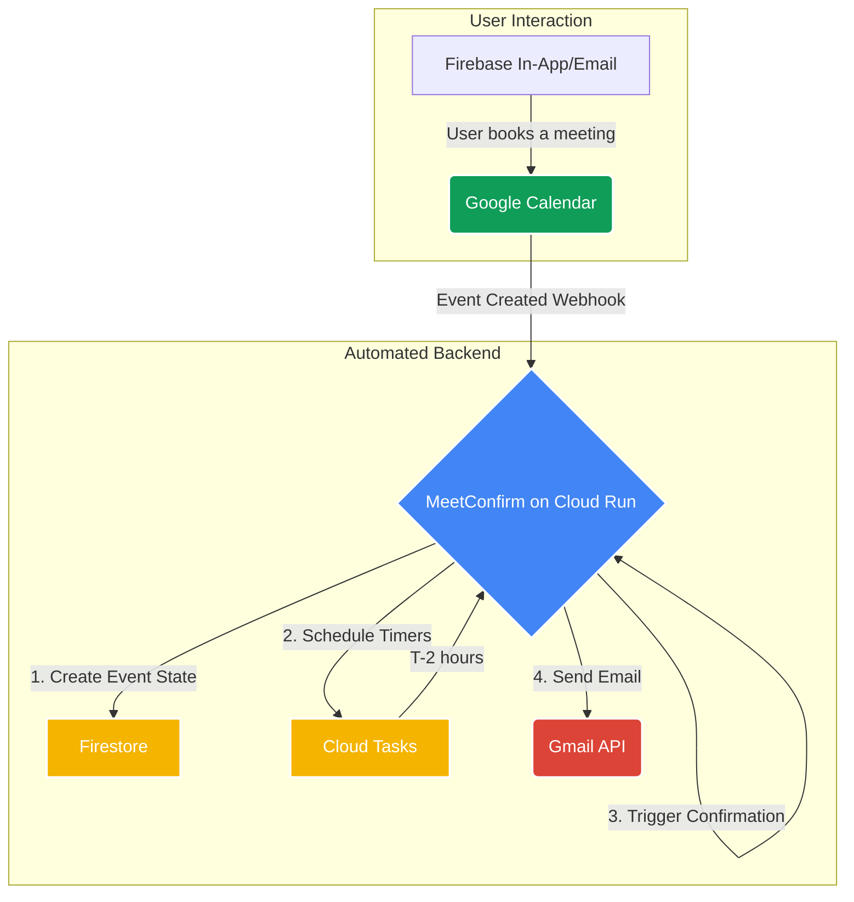

# MeetConfirm: The Last-Mile Confirmation Layer for Google Calendar

**Stop losing valuable time to no-shows.** Even when users eagerly book a meeting, plans change. MeetConfirm is a free, open-source tool that re-confirms attendance just before your meeting, protecting your schedule.

It's the perfect, cost-free addition to any booking flow that uses Google Calendar, whether it's a custom interface or Google's own appointment scheduling pages.

## The Problem: Plans Change, Calendars Don't

A user books a demo or an interview. At that moment, their intent is high. But a week later, priorities shift, emergencies happen, or they simply forget.

The result is a "no-show" — a blocked slot in your calendar that could have gone to another user. This leads to:
- **Wasted Time:** You're left waiting for someone who isn't coming.
- **Lost Opportunity:** A genuinely interested user couldn't book that slot.
- **Scheduling Uncertainty:** You can't fully trust your own calendar.

## The Solution: An Automated Commitment Check

MeetConfirm acts as an automated assistant, sending a simple confirmation request a few hours before the scheduled time. It's a polite, last-minute check to ensure the meeting is still relevant for the user.

- **Automated Re-Confirmation:** Asks users to confirm their attendance just before the event.
- **Unique Auto-Cancel Feature:** If there's no reply, MeetConfirm automatically cancels the event, freeing up your time and the calendar slot for others. This is our killer feature.
- **Works Everywhere:** Integrates with any process that creates events in Google Calendar.
- **15-Minute Setup:** Deploy once on the GCP free tier and it runs for virtually $0.

## MeetConfirm vs. The Alternatives

| Feature | MeetConfirm | Calendly / Cal.com | Google Calendar Built-in |
|---|---|---|---|
| **Best For** | **Re-confirming meetings** to prevent no-shows | All-in-one scheduling pages | Initial appointment booking |
| **Cost** | **$0 (Free Tier)** | $10-15/month | $0 |
| **Auto-cancellation on No-Reply** | ✅ **Unique Feature** | ❌ (Sends reminders only) | ❌ |
| **Setup Time** | 15 minutes | 5 minutes | N/A |
| **Data Privacy** | ✅ Self-hosted | 3rd-party service | Google's infrastructure |

### Onboarding and Confirmation Flow

| Welcome Email | Confirmation Request |
| :---: | :---: |
|  |  |

## The Google Vertical Chain

MeetConfirm is a powerful example of a "vertical chain" application built entirely on the Google Cloud stack. Each service seamlessly hands off to the next, creating a robust, automated workflow with minimal overhead.

This architecture demonstrates how to build a sophisticated, event-driven system without managing a single server or database cluster.

## Feature Highlights

*   **Automated Confirmations & Cancellations:** Reduce no-shows and administrative overhead.
*   **Deep Google Cloud Integration:** A showcase of Cloud Run, Cloud Tasks, Secret Manager, Firestore, Google Calendar, and Gmail.
*   **15-Minute Deployment:** Get up and running quickly with a single script.
*   **Open Source:** MIT licensed and fully transparent.

## Economic Model

MeetConfirm is designed to be virtually free for most real-world scenarios by leveraging the generous free tiers of Google Cloud services.

| Service          | Free Tier Limit        | Approx. Daily Capacity (Free) |
| ---------------- | ---------------------- | ----------------------------- |
| Cloud Run        | 2,000,000 reqs/month   | ~66,000 requests/day          |
| Firestore        | 50,000 reads/day       | ~6,000 bookings/day           |
| Cloud Tasks      | 500,000 tasks/month    | ~16,000 tasks/day             |
| Gmail API        | 2,000 emails/day (user)| 2,000 confirmations/day       |
| Calendar API     | 1,000,000 reqs/day     | Ample headroom                |
| Secret Manager   | 10,000 ops/month       | Ample headroom                |

**Estimated Costs:**
*   **≤ 1,000 meetings/day:** ≈ $0
*   **10,000 meetings/day:** < $10/month

## Stack Summary

| Component        | Purpose                               | Free Tier        | Notes                                     |
| ---------------- | ------------------------------------- | ---------------- | ----------------------------------------- |
| **Cloud Run**    | Core FastAPI application             | 2M reqs/mo       | Handles API endpoints and webhooks.       |
| **Firestore**    | Store event state (pending/confirmed) | 50k reads/day    | Simple, scalable, and cost-effective.     |
| **Cloud Tasks**  | Scheduler for delayed actions         | 500k tasks/mo    | Used for confirmation and cancellation timers. |
| **Gmail API**    | Send confirmation emails              | 2k/day per user  | Easily extendable with other email providers. |
| **Calendar API** | Watch for new events and cancel them  | 1M reqs/day      | The core of the event detection system.   |
| **Secret Manager**| Securely store credentials          | 10k ops/mo       | Manages OAuth tokens and signing keys.    |

---
**Used in Production at [HeartScan](https://heartscan.app)!**
*MeetConfirm powers the user interview scheduling for HeartScan, reducing no-shows by an estimated 40% and saving us hours of manual follow-up work each month.*
---

**Maintainer:** Michal Barodkin (Blatt sp. z o.o., Warsaw)  
*Founder at [HeartScan](https://heartscan.app) & Alumnus of [Google for Startups Campus, Warsaw](https://www.campus.co/warsaw/)*  
**Contact:** michal.b@heartscan.app  
*Built with Gemini 2.5 Pro + Cline (AI-assisted coding)*

## Intended Audience

This repository is a reference implementation for teams exploring full-stack automation within the Google Cloud ecosystem.

---

For deployment instructions, see [DEPLOY.md](DEPLOY.md).  
For a detailed look at the internal logic, see [ARCHITECTURE.md](ARCHITECTURE.md).
