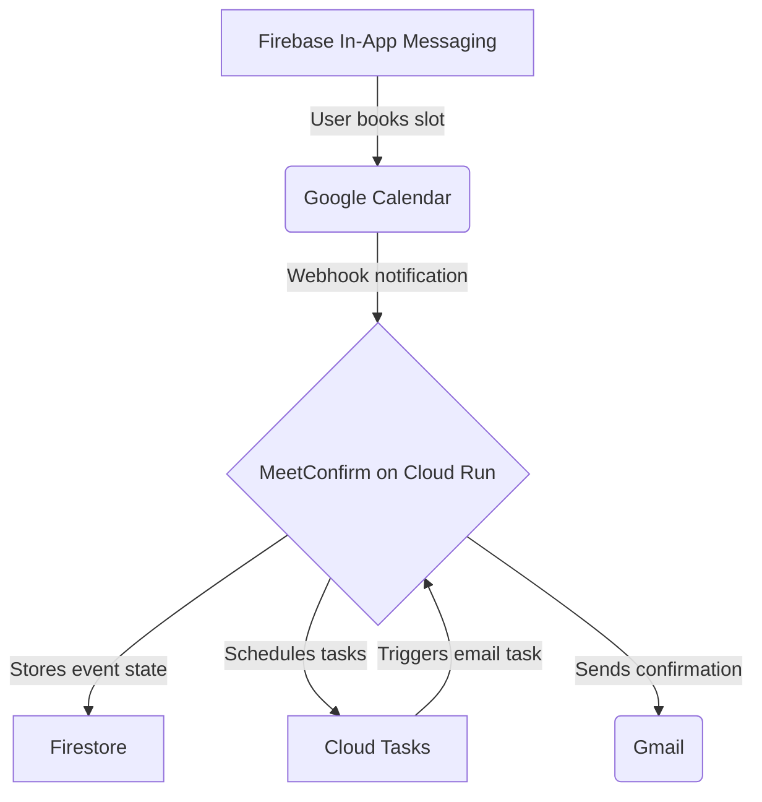

# MeetConfirm

**MeetConfirm is a personal, cost-free service for automatically confirming meetings scheduled via Google Calendar and notifying through Gmail.**

It was created as a practical tool for founders and product teams who use tools like Firebase In-App Messaging to schedule user interviews and demos. As Sam Altman might describe it, MeetConfirm is like "fast fashion SaaS": simple, useful, and nearly cost-free to operate.

### Onboarding and Confirmation Flow

| Welcome Email | Confirmation Request |
| :---: | :---: |
|  |  |

## Feature Highlights

*   **Automated Confirmations & Cancellations:** Automatically sends confirmation emails and cancels meetings that are not confirmed, freeing up your calendar.
*   **Deep Google Cloud Integration:** A showcase of vertical integration using Cloud Run, Cloud Tasks, Secret Manager, Firestore, Google Calendar, and Gmail.
*   **15-Minute Deployment:** Get up and running quickly with a single script. No complex YAML or DevOps experience required.
*   **Open Source:** MIT licensed and fully transparent.

## Use Case

MeetConfirm is designed to automate the final step of a user booking workflow, especially common in product development and user research:

1.  **Firebase In-App Messaging:** A user receives an in-app message with an invitation to book a meeting.
2.  **Google Calendar:** The user books a slot directly in your Google Calendar.
3.  **MeetConfirm:** The service detects the new event, schedules a confirmation email to be sent 2 hours before the meeting, and a cancellation task to run 1 hour before.
4.  **Gmail:** The user receives a confirmation email with a one-click confirmation link. If they don't confirm, the event is automatically deleted.

This entire process runs in the background, with no UI to manage.

## Google Architecture Overview

The project demonstrates a simple, powerful, vertically-integrated scenario on a single cloud stack.

## Economic Model

MeetConfirm is designed to be virtually free for most real-world scenarios by leveraging the generous free tiers of Google Cloud services.

| Service          | Free Tier Limit        | Approx. Daily Capacity (Free) |
| ---------------- | ---------------------- | ----------------------------- |
| Cloud Run        | 2,000,000 reqs/month   | ~66,000 requests/day          |
| Firestore        | 50,000 reads/day       | ~6,000 bookings/day           |
| Cloud Tasks      | 500,000 tasks/month    | ~16,000 tasks/day             |
| Gmail API        | 2,000 emails/day (user)| 2,000 confirmations/day       |
| Calendar API     | 1,000,000 reqs/day     | Ample headroom                |
| Secret Manager   | 10,000 ops/month       | Ample headroom                |

**Estimated Costs:**
*   **≤ 1,000 meetings/day:** ≈ $0
*   **10,000 meetings/day:** < $10/month

## Stack Summary

| Component        | Purpose                               | Free Tier        | Notes                                     |
| ---------------- | ------------------------------------- | ---------------- | ----------------------------------------- |
| **Cloud Run**    | Core FastAPI application             | 2M reqs/mo       | Handles API endpoints and webhooks.       |
| **Firestore**    | Store event state (pending/confirmed) | 50k reads/day    | Simple, scalable, and cost-effective.     |
| **Cloud Tasks**  | Scheduler for delayed actions         | 500k tasks/mo    | Used for confirmation and cancellation timers. |
| **Gmail API**    | Send confirmation emails              | 2k/day per user  | Easily extendable with other email providers. |
| **Calendar API** | Watch for new events and cancel them  | 1M reqs/day      | The core of the event detection system.   |
| **Secret Manager**| Securely store credentials          | 10k ops/mo       | Manages OAuth tokens and signing keys.    |

---

**Maintainer:** Michal Barodkin (Blatt sp. z o.o., Warsaw)  
**Contact:** michal.b@heartscan.app  
*Built with Gemini 2.5 Pro + Cline (AI-assisted coding)*

---

For deployment instructions, see [DEPLOY.md](DEPLOY.md).  
For a detailed look at the internal logic, see [ARCHITECTURE.md](ARCHITECTURE.md).
