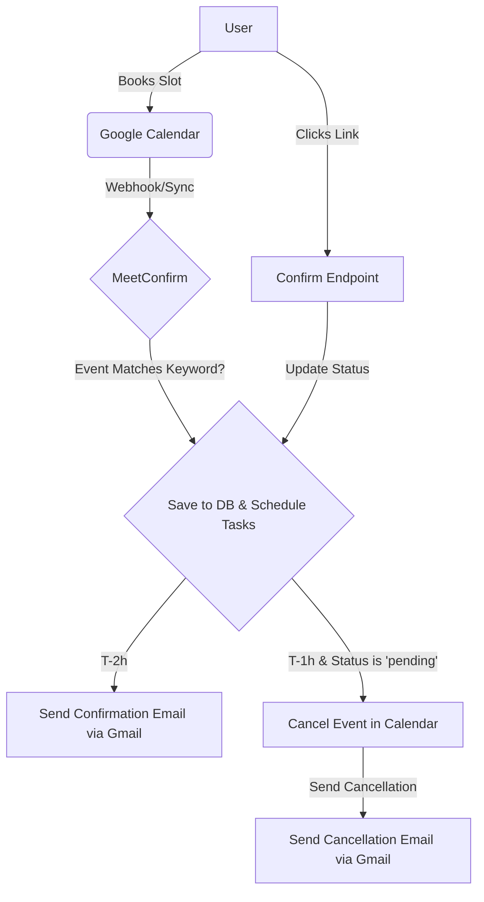

# MeetConfirm: Automated Meeting Confirmation System

MeetConfirm is the final link between your booking page and your inbox. It solves the no-show problem without relying on a third-party SaaS: everything runs in your own GCP infrastructure, giving you full control.

This lightweight, open-source tool automatically confirms or cancels meetings booked through a public Google Calendar appointment page. It helps reduce no-shows by sending a confirmation email before the meeting and automatically canceling it if no confirmation is received.

**License:** MIT

## 🎯 Use Case

**Problem:** When you use a public Google Calendar link for mass bookings (e.g., for user interviews, sales calls, or consultations), a significant percentage of people may not show up. This leads to wasted time and lost opportunities.

**Solution:** MeetConfirm acts as a personal, automated assistant for your Google Calendar. It monitors your calendar for new meetings that match a specific keyword (e.g., "HeartScan", "Consulting Call").

-   **T-2 Hours:** It sends a polite email to the attendee asking them to confirm their attendance with a single click.
-   **T-1 Hour:** If the meeting is not confirmed, MeetConfirm automatically removes the event from your calendar and sends a cancellation notice to the attendee, freeing up your time.

## 🚀 Vertical Integration

The project fits into a larger ecosystem, automating the final step of the booking process:

**Google Play Market (or any app store) → Firebase (or any backend) → Google Calendar → MeetConfirm → Gmail**

## 🏗️ Architecture

MeetConfirm is built with Python (FastAPI) and runs as a single container on Google Cloud Run.

### Data Flow Diagram



### Components

-   **Cloud Run:** Hosts the main FastAPI application which handles all logic.
-   **Cloud SQL (Postgres):** Stores event information and status.
-   **Cloud Tasks:** Schedules confirmation and cancellation emails.
-   **Secret Manager:** Securely stores your Google OAuth credentials.
-   **Google Calendar & Gmail APIs:** To watch for events and send notifications.

## 📦 Getting Started: 15-Minute Deployment

### Prerequisites

1.  A Google Cloud Platform (GCP) project with billing enabled.
2.  `gcloud` CLI installed and authenticated (`gcloud auth login`).
3.  A public Google Calendar appointment scheduling page.
    *Example of a public booking page:*
    ** 
    *(You will need to replace this with your own screenshot)*

### Step 1: Clone the Repository

```bash
git clone https://github.com/mihmosh/MeetConfirm.git
cd MeetConfirm
```

### Step 2: Run the Deployment Script

The interactive script handles the entire setup.

**For Windows (PowerShell):**
```powershell
./scripts/deploy.ps1
```

**For Linux/macOS:**
```bash
chmod +x scripts/deploy.sh
./scripts/deploy.sh
```

The script will automatically guide you through:
1.  Project configuration and API enablement.
2.  OAuth credential creation (a one-time manual step in your browser).
3.  Secure storage of all secrets.
4.  Database and task queue creation.
5.  Building and deploying the application.
6.  Final setup of the calendar watch.

## 🔧 Configuration

The application is configured via environment variables and secrets passed during the deployment script:

| Variable | Description | Default |
|----------|-------------|---------|
| `DATABASE_URL` | PostgreSQL connection string | Required |
| `EVENT_TITLE_KEYWORD` | Keyword to filter calendar events | Required |
| `TIMEZONE` | Your local timezone | `UTC` |
| `SERVICE_URL` | Your Cloud Run service URL | Required |
| `GOOGLE_CREDENTIALS` | JSON with client_id, client_secret, and refresh_token (from Secret Manager) | Required |
| `DB_PASSWORD` | Password for the Cloud SQL user (from Secret Manager) | Required |
| `TOKEN_SIGNING_KEY` | HMAC key for confirmation tokens (from Secret Manager) | Required |

## 📊 Monitoring & Metrics

### Health Check

A simple endpoint to verify the service is running.
```bash
curl https://your-service-url.run.app/api/v1/healthz
```

### Metrics Endpoint

This endpoint provides key statistics in JSON format, ready for integration with monitoring systems like Prometheus or Grafana.
```bash
curl https://your-service-url.run.app/api/v1/metrics
```

### Logs

View real-time application logs:
```bash
gcloud run logs read --service meetconfirm --region us-central1 --limit 100 --project YOUR_PROJECT_ID
```

## 💰 Cost Estimate

For typical usage (10-50 meetings per month):

- **Cloud Run:** ~$0-5/month (generous free tier)
- **Cloud SQL:** ~$7-10/month (db-f1-micro instance)
- **Total:** **~$7-15/month**

## 🤝 Contributing

Contributions are welcome! Please feel free to submit a Pull Request.

## 📝 License

This project is licensed under the MIT License - see the [LICENSE](LICENSE) file for details.

## 📧 Contact

**Maintainer:** Michal Barodkin  
**Email:** michal.b@heartscan.app  
**Company:** Blatt sp. z o.o. (Warsaw, Poland)  
**LinkedIn:** https://www.linkedin.com/in/michal-barodkin/
